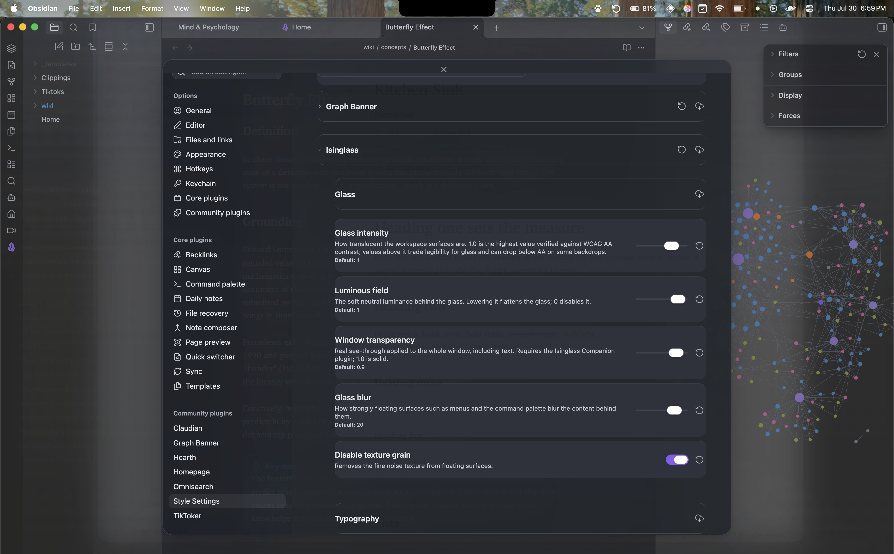

# Isinglass

A minimal, translucent frosted-glass theme for Obsidian. Light and dark, for macOS, Windows,
and iOS. Colourless by design: luminance does the work, hue only whispers.

*Isinglass* is a thin transparent sheet of mica.





## What you get out of the box

- A layered glass interface: a soft neutral luminous field behind frosted panes, specular
  edges, fine grain, and real backdrop blur on floating surfaces (menus, command palette,
  modals, popovers).
- Both modes, colourless. Your accent colour drives highlights, links, and the graph's focus
  colour; the surfaces themselves stay neutral.
- New York (ui-serif) for reading, the system font for interface, on every platform. Nothing
  bundled.
- Styled support for Dataview, Tasks, and Notebook Navigator, plus Canvas, Bases, and the
  graph.

## Built to stay legible

Translucency fights contrast, so this theme verifies instead of eyeballing: every build
composites every text token over every surface, at every translucency state, against
worst-case backdrops, and fails if any pair drops below WCAG AA. Enforced budgets keep
`backdrop-filter` use, `!important` count, and file size in check.

The theme honours `prefers-reduced-transparency` and `prefers-reduced-motion`, ships an
opaque high-contrast mode, and responds to the OS "reduce transparency" setting.

## Style Settings

Install the [Style Settings](https://github.com/mgmeyers/obsidian-style-settings) plugin for:

- Glass intensity (up to 30% past the AA-verified ceiling, labelled as such)
- Luminous field strength
- Glass blur, texture grain
- Window transparency (with the companion plugin below)
- Reading line width, body line height, compact density
- Hide tab bar / ribbon / status bar
- High contrast mode (with a command)

## Going further: real window transparency

Out of the box, every platform gets the painted glass above. Obsidian currently ships a
window-transparency regression (since 1.8.9) that blocks true see-through on macOS; two
optional extras in this repo work around it:

- **Isinglass Companion** (`companion/`, a small plugin): keeps the window appearance in sync
  with your Obsidian theme so the OS material always matches, and applies the "Window
  transparency" slider for real whole-window see-through.
- **macOS vibrancy patch** (`companion/patch-macos-vibrancy.mjs`): restores true OS-blurred
  frost behind the window by fixing Obsidian's missing `transparent` window flag. One-line
  in-place patch, full backup, `--revert` included. Re-run after Obsidian updates. Use at
  your own discretion — it modifies the installed app.
- **Windows**: the [Pseudo Mica](https://github.com/aaaaalexis/obsidian-pseudo-mica) plugin
  enables real Mica/Acrylic materials; Isinglass detects it and opens its surfaces
  automatically. No patch needed.

The theme detects a real material via Obsidian's own translucency state and re-balances
itself: the painted field steps back and the genuine frost carries the glass.

## Install

Until the theme is in the community gallery: copy `manifest.json` and `theme.css` into
`<your vault>/.obsidian/themes/Isinglass/`, then select Isinglass under Settings →
Appearance → Themes.

## Development

```bash
npm install
npm run build   # sass -> theme.css, then contrast + budget verification
npm run watch
```

Edit the SCSS modules in `src/`, never `theme.css`. The build fails on any WCAG AA
regression or budget overrun.

## Licence

MIT
